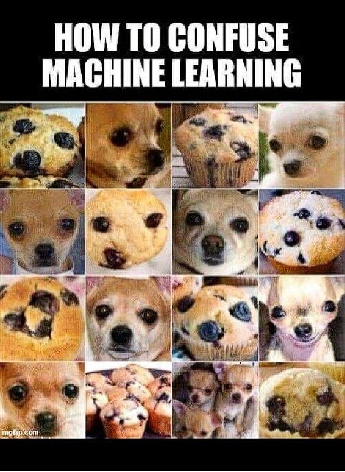

# Clasificación de Imágenes: Muffin vs Chihuahua

Este proyecto implementa y compara varios modelos de redes neuronales para la clasificación de imágenes, utilizando el dataset de **Muffin vs Chihuahua** disponible en [Kaggle](https://www.kaggle.com/datasets/samuelcortinhas/muffin-vs-chihuahua-image-classification). La tarea principal es diferenciar entre imágenes de muffins y chihuahuas, dos categorías visualmente similares.




## Tabla de Contenidos
- [Descripción del Proyecto](#descripción-del-proyecto)
- [Estructura del Proyecto](#estructura-del-proyecto)
- [Dataset](#dataset)
- [Modelos Implementados](#modelos-implementados)
- [Requisitos Previos](#requisitos-previos)
- [Instrucciones de Uso](#instrucciones-de-uso)
- [Resultados](#resultados)
- [Autor](#autor)

## Descripción del Proyecto

El proyecto utiliza redes neuronales convolucionales (CNNs) para realizar una clasificación binaria de imágenes. Se implementaron y evaluaron tres modelos:
1. Un modelo convolucional básico.
2. Un modelo convolucional mejorado.
3. Un modelo avanzado basado en transferencia de aprendizaje con **MobileNet**.

El objetivo principal es comparar el desempeño de estos modelos en términos de precisión, f1-score y otras métricas de evaluación.

## Estructura del Proyecto


- **datasets/**: Contiene las imágenes organizadas en carpetas `train` y `test`.
- **notebooks/**: Archivos Jupyter Notebook con los modelos implementados.
- **README.md**: Documentación del proyecto.
- **requirements.txt**: Lista de dependencias necesarias para ejecutar el proyecto.

## Dataset

El dataset utilizado es **Muffin vs Chihuahua**, descargado desde Kaggle. Este dataset contiene imágenes de dos categorías:
- **Muffins**
- **Chihuahuas**

Cada categoría está organizada en subcarpetas dentro de `train/` y `test/`.

## Modelos Implementados

### Modelo 1: Convolucional Básico
- Varias capas de convolución (`Conv2D`) y agrupamiento (`MaxPooling2D`).
- Regularización con `Dropout` para prevenir sobreajuste.

### Modelo 2: Convolucional Mejorado
- Incluye normalización por lotes (`BatchNormalization`) para estabilizar el entrenamiento.
- Mayor profundidad y capacidad de representación.

### Modelo 3: Transferencia de Aprendizaje
- Utiliza **MobileNet** preentrenado con pesos de ImageNet.
- Congela las capas convolucionales y añade capas densas personalizadas.

## Requisitos Previos

1. **Python 3.8+**
2. Instalación de dependencias:
   ```bash
   pip install -r requirements.txt


